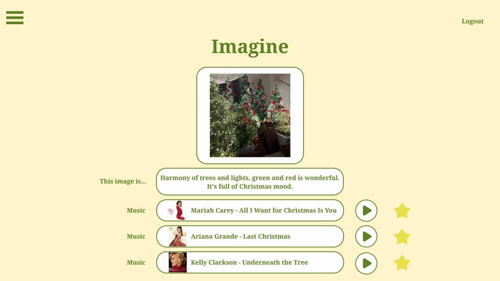

# Imagine
이미지 분석을 통한 감성노래 추천 웹서비스

## Introduction
> 개발 기간: 2024.03 ~ 2024.11

## Achivement
> 2024년도 캡스톤 디자인 프로젝트

## Collaborators

|박진하(팀장)|주서영(팀원)|
|[Git](https://github.com/202010777)|[Git](https://github.com/standyoung)|

## Service Architecture
- Frontend Tech Stack 🛠 박진하
- Backend Tech Stack 🛠 주서영

## Main Feature

> 이미지 기반 음악 추천 🎧
사용자가 업로드한 이미지를 AI 모델(BLIP)이 분석하여 감정적 키워드(예: ‘따뜻함’, ‘우울함’, ‘자유로움’)를 추출합니다.
이 키워드를 바탕으로 Spotify API를 활용해 감성에 어울리는 곡을 자동 추천합니다.

> 감정 분석 시각화 🎨
이미지에서 분석된 감정 결과를 시각적으로 표현(예: 색상 차트, 키워드 클라우드)하여
사용자가 자신의 이미지가 가진 분위기를 직관적으로 이해할 수 있습니다.

> 사용자 맞춤형 재추천 기능 🔁
사용자가 추천 결과에 “좋아요/싫어요” 피드백을 남기면,
그 데이터를 기반으로 더 정교한 감정-음악 매칭이 이루어집니다.

> 마이페이지 / 히스토리 관리 📁
이전에 업로드한 이미지와 추천 결과를 한눈에 확인할 수 있는 히스토리 기능을 제공합니다.

## Service Introduction
> Imagine은 “보이는 감정이 들리는 음악으로 이어지면 어떨까?” 라는 아이디어에서 출발한 웹 서비스입니다.
사용자는 자신이 촬영한 사진 한 장만 업로드하면,
AI가 이미지 속 분위기와 감정을 분석해 가장 어울리는 음악 플레이리스트를 추천해 줍니다.

기존의 음악 추천 서비스가 청취 이력이나 장르 중심이었다면,
Imagine은 ‘시각적 감성’을 중심으로 한 감정 기반 음악 추천이라는 새로운 접근을 시도합니다.

또한 단순한 AI 결과에 그치지 않고,
사용자가 직접 피드백을 주고 자신의 감정 취향을 발견해 나갈 수 있는 인터랙티브 감성 플랫폼을 목표로 합니다.
